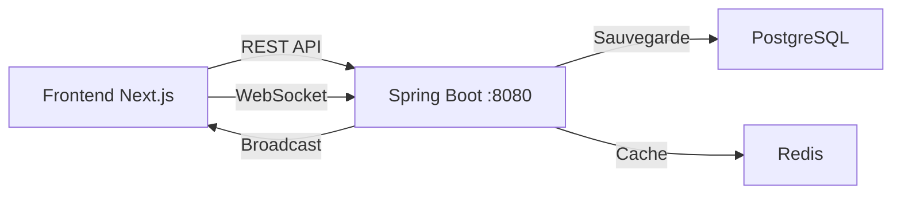

# Services Bus - Guide d'Utilisation

Ce dossier contient les services pour gérer les bus et leur géolocalisation en temps réel.

## Architecture



### Flux de Données

1. **Mise à jour de position** → REST API → PostgreSQL + Redis → WebSocket Broadcast
2. **Réception temps réel** → WebSocket → Listeners Frontend
3. **Lecture dernière position** → REST API → Redis

---

## Services Disponibles

### 1. `BusService` - Gestion des bus

```typescript
import { BusService } from "@/services/bus/service"

// Lister tous les bus
const buses = await BusService.list()

// Obtenir un bus spécifique
const bus = await BusService.get(1)

// Créer un nouveau bus
const newBus = await BusService.create({
  matricule: "BUS-001",
  description: "Ligne 1 - Centre Ville",
  trajetId: 1
})

// Mettre à jour un bus
const updated = await BusService.update(1, {
  matricule: "BUS-001-UPDATED",
  description: "Nouvelle description",
  trajetId: 2
})

// Supprimer un bus
await BusService.delete(1)
```

---

### 2. `LocationService` - Géolocalisation REST

```typescript
import { LocationService } from "@/services/bus/location-service"

// Mettre à jour la position d'un bus
// ⚠️ Déclenche automatiquement un broadcast WebSocket
await LocationService.updateLocation({
  busId: 1,
  latitude: 48.8566,
  longitude: 2.3522,
  timestamp: Date.now()
})

// Récupérer la dernière position connue
const location = await LocationService.getLatestLocation(1)
console.log(location?.latitude, location?.longitude)
```

---

### 3. `busSocketService` - WebSocket Temps Réel

> [!IMPORTANT]
> Ce service est **en lecture seule**. Pour envoyer une position, utilisez `LocationService.updateLocation()`.

```typescript
import { busSocketService } from "@/services/bus/socket"

// S'abonner aux mises à jour en temps réel
const unsubscribe = busSocketService.addListener((payload) => {
  console.log(`Bus ${payload.busId} à:`, payload.latitude, payload.longitude)
  // Mettre à jour la carte, l'UI, etc.
})

// Vérifier la connexion
if (busSocketService.isConnected()) {
  console.log("WebSocket connecté ✅")
}

// Se désabonner (important lors du démontage du composant)
useEffect(() => {
  return unsubscribe
}, [])
```

---

## Exemple Complet : Tracking en Temps Réel

```typescript
"use client"

# Services Bus - Guide d'Utilisation

Ce dossier contient les services pour gérer les bus et leur géolocalisation en temps réel.

## Architecture


### Flux de Données

1. **Mise à jour de position** → REST API → PostgreSQL + Redis → WebSocket Broadcast
2. **Réception temps réel** → WebSocket → Listeners Frontend
3. **Lecture dernière position** → REST API → Redis

---

## Services Disponibles

### 1. `BusService` - Gestion des bus

```typescript
import { BusService } from "@/services/bus/service"

// Lister tous les bus
const buses = await BusService.list()

// Obtenir un bus spécifique
const bus = await BusService.get(1)

// Créer un nouveau bus
const newBus = await BusService.create({
  matricule: "BUS-001",
  description: "Ligne 1 - Centre Ville",
  trajetId: 1
})

// Mettre à jour un bus
const updated = await BusService.update(1, {
  matricule: "BUS-001-UPDATED",
  description: "Nouvelle description",
  trajetId: 2
})

// Supprimer un bus
await BusService.delete(1)
```

---

### 2. `LocationService` - Géolocalisation REST

```typescript
import { LocationService } from "@/services/bus/location-service"

// Mettre à jour la position d'un bus
// ⚠️ Déclenche automatiquement un broadcast WebSocket
await LocationService.updateLocation({
  busId: 1,
  latitude: 48.8566,
  longitude: 2.3522,
  timestamp: Date.now()
})

// Récupérer la dernière position connue
const location = await LocationService.getLatestLocation(1)
console.log(location?.latitude, location?.longitude)
```

---

### 3. `busSocketService` - WebSocket Temps Réel

> [!IMPORTANT]
> Ce service est **en lecture seule**. Pour envoyer une position, utilisez `LocationService.updateLocation()`.

```typescript
import { busSocketService } from "@/services/bus/socket"

// S'abonner aux mises à jour en temps réel
const unsubscribe = busSocketService.addListener((payload) => {
  console.log(`Bus ${payload.busId} à:`, payload.latitude, payload.longitude)
  // Mettre à jour la carte, l'UI, etc.
})

// Vérifier la connexion
if (busSocketService.isConnected()) {
  console.log("WebSocket connecté ✅")
}

// Se désabonner (important lors du démontage du composant)
useEffect(() => {
  return unsubscribe
}, [])
```

---

## Exemple Complet : Tracking en Temps Réel

```typescript
"use client"

import { useEffect, useState } from "react"
import { busSocketService } from "@/services/bus/socket"
import { LocationService } from "@/services/bus/location-service"
import type { BusLocationPayload } from "@/types/bus"

export function BusTracker({ busId }: { busId: number }) {
  const [position, setPosition] = useState<BusLocationPayload | null>(null)

  useEffect(() => {
    // 1. Charger la dernière position connue
    LocationService.getLatestLocation(busId).then(setPosition)

    // 2. S'abonner aux mises à jour en temps réel
    const unsubscribe = busSocketService.addListener((payload) => {
      if (payload.busId === busId) {
        setPosition(payload)
      }
    })

    // 3. Nettoyage lors du démontage
    return unsubscribe
  }, [busId])

  if (!position) return <div>Chargement...</div>

  return (
    <div>
      <h2>Position du Bus #{busId}</h2>
      <p>Latitude: {position.latitude}</p>
      <p>Longitude: {position.longitude}</p>
    </div>
  )
}
```

---

## Exemple : Simulateur de Position

```typescript
import { LocationService } from "@/services/bus/location-service"

async function simulateMovement(busId: number) {
  const positions = [
    { lat: 48.8566, lng: 2.3522 },  // Paris
    { lat: 48.8606, lng: 2.3376 },
    { lat: 48.8738, lng: 2.2950 },
  ]

  for (const pos of positions) {
    await LocationService.updateLocation({
      busId,
      latitude: pos.lat,
      longitude: pos.lng,
      timestamp: Date.now()
    })
    
    // Tous les clients WebSocket recevront la mise à jour automatiquement
    await new Promise(resolve => setTimeout(resolve, 5000))
  }
}
```

---

## Configuration

### Variables d'Environnement

Créez un fichier `.env.local` (voir `.env.example`) :

```env
NEXT_PUBLIC_WS_URL=http://localhost:8080/ws
```

### Backend Spring Boot

Le backend doit être lancé sur le port **8080** avec :
- PostgreSQL pour l'historique des positions
- Redis pour le cache de la dernière position
- WebSocket STOMP sur `/ws`

---

## Types TypeScript

```typescript
import type { Bus, BusPayload, LocationDTO, BusLocationPayload } from "@/types/bus"

// Bus entity
const bus: Bus = {
  id: 1,
  matricule: "BUS-001",
  description: "Ligne 1",
  trajetId: 1
}

// Location update payload
const location: LocationDTO = {
  busId: 1,
  latitude: 48.8566,
  longitude: 2.3522,
  timestamp: Date.now()
}

// WebSocket payload (reçu en temps réel)
const wsPayload: BusLocationPayload = {
  busId: 1,
  latitude: 48.8566,
  longitude: 2.3522
}
```

---

## Endpoints Backend

| Méthode | Endpoint | Description |
|---------|----------|-------------|
| `POST` | `/api/bus` | Créer un bus |
| `GET` | `/api/bus` | Lister tous les bus |
| `GET` | `/api/bus/{id}` | Obtenir un bus |
| `PUT` | `/api/bus/{id}` | Mettre à jour un bus |
| `DELETE` | `/api/bus/{id}` | Supprimer un bus |
| `POST` | `/api/location` | Met à jour la position |
| `GET` | `/api/location/{busId}` | Dernière position |

### WebSocket

- **Endpoint**: `ws://localhost:8080/ws` (SockJS)
- **Topic**: `/topic/bus-location` (broadcast automatique)
- **Protocole**: STOMP over SockJS

---

## Dépannage

### WebSocket ne se connecte pas

1. Vérifiez que le backend Spring Boot tourne sur le port 8080
2. Vérifiez `NEXT_PUBLIC_WS_URL` dans `.env.local`
3. Ouvrez la console : vous devriez voir "WebSocket connecté ✅"

### Les mises à jour ne sont pas reçues

1. Vérifiez que vous êtes abonné via `busSocketService.addListener()`
2. Testez avec `curl -X POST http://localhost:8080/api/location`
3. Vérifiez les logs Spring Boot pour voir le broadcast

### Erreur CORS

Le backend Spring Boot doit autoriser l'origine `http://localhost:3000` dans sa configuration CORS.
